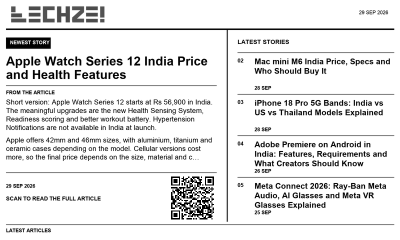

# Techzei TRMNL Dashboard

A TRMNL private plugin that puts the newest Techzei story and four recent headlines on one screen. The full view shows article text and a QR code to open the story.

## Install the current build

1. In TRMNL, open **Plugins → Private Plugin → Import new**.
2. Upload [`techzei-trmnl-dashboard.zip`](techzei-trmnl-dashboard.zip).
3. Open the plugin settings and choose **Force Refresh**.
4. Add the full view to your playlist.

The plugin polls the public [Techzei RSS feed](https://techzei.com/feed/) every 60 minutes. The full view uses the first two article paragraphs when the feed provides them, and falls back to the RSS description. The wordmark is loaded from Techzei’s public site asset.

## Source files

- `plugin/`: settings and Liquid layouts for full, half, and quadrant views.
- `techzei-trmnl-dashboard.zip`: flat import package for TRMNL.
- `preview.png`: static design preview based on the feed order visible on 29 September 2026.
- `assets/techzei-logo.png`: copy of the Techzei wordmark used in the preview.

This repository is a development snapshot for a private TRMNL plugin. It is not a TRMNL Recipe or a formal release.
